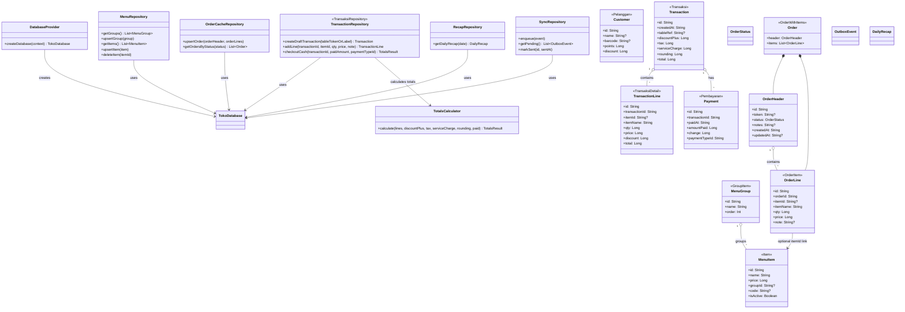
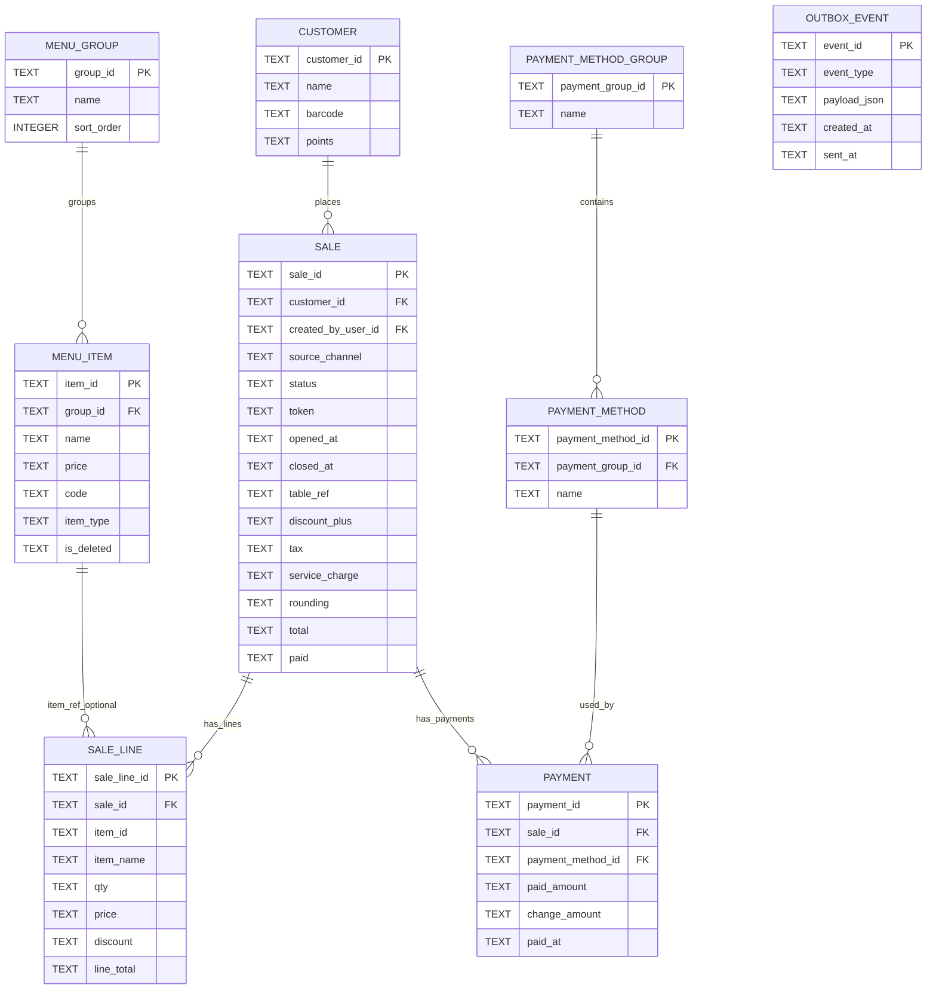

# SuCash Architecture Diagrams

## Class Diagram (English, with Actual Class Mapping)

## ERD (Unified Sale View)

## IRD (Information Relationship Diagram View)

### Entities and Keys

| Entity | Primary Key | Foreign Keys |
|---|---|---|
| `MENU_GROUP` | `group_id` | - |
| `MENU_ITEM` | `item_id` | `group_id -> MENU_GROUP.group_id` |
| `CUSTOMER` | `customer_id` | - |
| `PAYMENT_METHOD_GROUP` | `payment_group_id` | - |
| `PAYMENT_METHOD` | `payment_method_id` | `payment_group_id -> PAYMENT_METHOD_GROUP.payment_group_id` |
| `SALE` | `sale_id` | `customer_id -> CUSTOMER.customer_id` |
| `SALE_LINE` | `sale_line_id` | `sale_id -> SALE.sale_id`, `item_id -> MENU_ITEM.item_id` (logical/optional) |
| `PAYMENT` | `payment_id` | `sale_id -> SALE.sale_id`, `payment_method_id -> PAYMENT_METHOD.payment_method_id` |
| `OUTBOX_EVENT` | `event_id` | - |

### Relationship Matrix

| Parent | Child | Cardinality | Meaning |
|---|---|---|---|
| `MENU_GROUP` | `MENU_ITEM` | `1:N` | One group has many menu items |
| `CUSTOMER` | `SALE` | `1:N` | One customer can have many sales |
| `PAYMENT_METHOD_GROUP` | `PAYMENT_METHOD` | `1:N` | One method group contains many methods |
| `SALE` | `SALE_LINE` | `1:N` | One sale has many sale lines |
| `SALE` | `PAYMENT` | `1:N` | One sale can have multiple payments |
| `PAYMENT_METHOD` | `PAYMENT` | `1:N` | One method is used by many payments |
| `MENU_ITEM` | `SALE_LINE` | `1:N` (optional link) | One item can appear in many sale lines |

### IRD Notes

- `SALE` is a unified conceptual entity for the full lifecycle (order + checkout).
- `OUTBOX_EVENT` is standalone for async sync and idempotent push workflows.
- `SALE_LINE.item_id` remains optional to preserve historical rows even if item records change or are deleted.

## Physical Table Mapping (Actual SQLDelight Tables)

- `MENU_GROUP` -> `toko_group_item`
- `MENU_ITEM` -> `toko_item`
- `CUSTOMER` -> `toko_pelanggan`
- `PAYMENT_METHOD_GROUP` -> `toko_group_bayar`
- `PAYMENT_METHOD` -> `toko_jenis_bayar`
- `SALE` -> `toko_transaksi` + `order_header` (unified conceptual view)
- `SALE_LINE` -> `toko_transaksi_detail` + `order_item` (unified conceptual view)
- `PAYMENT` -> `toko_pembayaran`
- `OUTBOX_EVENT` -> `sync_outbox`

## Important Clarifications

- This ERD is intentionally simplified as one sales lifecycle (`SALE` -> `SALE_LINE` -> `PAYMENT`).
- In physical storage today, order and transaction are still separate tables.
- `item_id` on order lines is a logical link and is not enforced as a foreign key in the current schema.
- `pay-at-table` is not implemented yet; token/order fields are kept for future compatibility.
